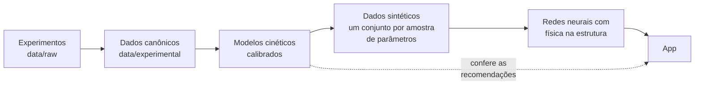

# Metodologia do Ethanol AI

Este documento explica como os modelos do app são construídos, de onde vêm os números e onde
estão os limites de cada um. Ele foi escrito para quem vai continuar o projeto.

## 1. Visão geral



A ideia central do projeto continua a mesma: **gerar dados a partir dos experimentos para treinar
redes que prevejam o processo**. Os experimentos são poucos (21 amostras de licor no pré-tratamento,
8 ensaios de hidrólise), então eles calibram modelos cinéticos com base física; esses modelos
geram milhares de condições; e as redes aprendem a partir delas.

Cada etapa é um script em `pipeline/` (ver `pipeline/README.md`). Os relatórios gerados ficam em
`reports/`.

## 2. Dados experimentais

### Pré-tratamento hidrotérmico

Rocha et al. (2017), *Bioresource Technology* 228:176-185 (`docs/references/pretreatment_article.pdf`).
Reator Parr de 5,5 L, palha de cana com 34,8% de celulose, 23,0% de hemicelulose, 24,1% de lignina,
14,9% de extrativos e 7,1% de cinzas, sólido:líquido 1:10 (100 g/L), 180, 195 e 210 °C, amostras
do licor em 0, 5, 10, 15, 20, 30 e 40 min **após o reator atingir a temperatura**. Foram medidos
glicose (+ celobiose), xilose, arabinose, oligômeros de glicose, xilose e arabinose, HMF, furfural e
ácidos fórmico, acético e glucurônico. O sólido remanescente não foi medido ao longo do tempo.

### Hidrólise enzimática

Planilha original `data/raw/hydrolysis/OriginalSpreadsheet.xlsx`: 8 ensaios em duplicata com palha
pré-tratada (66,55% de celulose, 8,2% de xilana), Cellic CTec2, 150 g/L de sólidos com 5 a 60 FPU/g
de celulose e um ensaio com 200 g/L e 10 FPU/g. Glicose, xilose e celobiose de 1 a 96 h, já
descontadas das quantidades presentes no próprio extrato enzimático (controles).

### Correções (pipeline/00_build_experimental_data.py)

| Problema no CSV antigo | Correção |
|---|---|
| O ensaio com 200 g/L de sólidos tinha 0,175 g/L de enzima, o mesmo valor do ensaio com 150 g/L | A dose é por grama de celulose (10 FPU/g nos dois), e o volume pipetado foi 0,325 mL contra 0,244 mL: a carga real é **0,233 g/L** |
| Celobiose igual a zero em vários tempos iniciais | É censura: a celobiose medida era menor que a do extrato enzimático e a correção foi cortada em zero. Esses pontos ficam marcados e fora da calibração |
| Réplicas idênticas (desvio zero) às 72 h de um ensaio | Marcadas; a celobiose desse ponto fica fora da calibração |
| Composição arredondada (66% / 8,3%) | Valores da planilha (66,55% / 8,2%) |
| A geração de dados antiga assumia lignina = 100% − celulose − hemicelulose | A palha real tem 22% de extrativos e cinzas; a lignina não entra em nenhum dos modelos e deixou de ser entrada |

A carga de enzima em g/L de proteína segue a regra que reproduz os 8 ensaios:
`E [g/L] = FPU/g celulose × sólidos [g/L] × fração de celulose × 1,753·10⁻⁴`.

## 3. Modelo do pré-tratamento (`ethanol_ai/pretreatment.py`)

Mesma rede de reações de primeira ordem de Rocha et al. (2017), para cada fração polimérica:

```
polímero ─k2→ oligômeros ─k3→ monômeros ─k4→ furano ─k6→ degradação
polímero ─k1→ monômeros  ─k5→ degradação
```

O que mudou:

1. **Base anidra.** Os estados são massas de glucana ou xilana; as saídas são convertidas para as
   unidades medidas (xilose = 1,136 × xilana; furfural = 0,727 × pentosana etc.). O balanço de massa
   fecha exatamente.
2. **Arrhenius global.** Antes, seis k eram ajustados em cada temperatura e interpolados linearmente
   (com k "congelado" fora de 180–210 °C). Agora `k(T) = k_ref · exp(−Ea/R · (1/T − 1/T_ref))`
   é ajustado às três temperaturas de uma vez, com uma priori fraca nas energias de ativação
   (120 ± 50 kJ/mol), porque com três temperaturas algumas não ficam bem determinadas.
3. **Aquecimento do reator.** Em t = 0 já existem produtos (a 210 °C, 4,7 g/L de xilo-oligômeros).
   O modelo integra uma rampa linear de 100 °C até a temperatura de operação, com a taxa de
   aquecimento ajustada. Isso torna o modelo contínuo em temperatura sem usar as medidas de t = 0
   como condição inicial.
4. **Açúcares livres** dos extrativos como concentração inicial no licor.
5. **Solução exata** `y(t) = expm(K t) y0` em vez de integração numérica.

O ácido fórmico entra como marcador da degradação da celulose (um mol por hexose), com peso
reduzido, como fazia o trabalho original.

Resultados em `reports/pretreatment_calibration.md`.

**Limitações**
- A perda de celulose é inferida dos produtos no licor (o sólido não foi medido) e atribui todo o
  ácido fórmico à celulose; deve ser lida como estimativa superior.
- O ensaio a 210 °C tem mais furfural em t = 0 do que a rampa explica (provável aquecimento mais longo).
- Carga de sólidos e composição só escalam as quantidades iniciais (primeira ordem). Só 100 g/L e
  uma palha foram medidos; a faixa "validada" do app para essas variáveis é uma premissa.

## 4. Modelo da hidrólise (`ethanol_ai/hydrolysis.py`)

Estrutura de Angarita et al. (2015), da família de Kadam et al. (2004): quatro reações (celulose →
celobiose, celulose → glicose, celobiose → glicose, xilana → xilose), adsorção de Langmuir,
inibição por glicose, celobiose e xilose, e reatividade do substrato `R_S = (S/S0)^γ`.

O que mudou:

1. **Calibração com os 8 ensaios** (antes: parâmetros da literatura sem ajuste). Mínimos quadrados
   ponderados pelo desvio das réplicas, com priori log-normal em torno dos valores publicados
   (estimativa MAP). A priori segura os parâmetros que 8 ensaios não determinam.
2. **Escolha da estrutura por validação cruzada** (deixando um ensaio de fora). Foram testadas
   adsorção fixada em t = 0 (original) ou recalculada, expoente γ fixo ou ajustado, fração reativa
   da celulose e dois pools de celulose. A escolhida tem **adsorção quase-estacionária, γ ajustado e
   fração reativa**: os dados mostram um platô em ~63% de conversão que não aumenta com mais enzima
   (a partir de 15 FPU/g a glicose final fica entre 65 e 71 g/L), sinal de celulose recalcitrante.
3. **Equilíbrio de Langmuir analítico** (raiz de uma quadrática) em vez de `fsolve`.

Resultados em `reports/hydrolysis_calibration.md`.

**Limitações**
- O ensaio a 200 g/L começa bem mais devagar do que o modelo prevê e só o alcança no fim (efeito de
  alto teor de sólidos: mistura e transferência de massa). Com um único ensaio nessa carga não dá para
  calibrar um termo próprio sem sobreajuste.
- As cargas de 30 e 60 FPU/g têm uma liberação inicial muito rápida que o modelo suaviza; esses
  pontos têm desvio entre réplicas alto.
- Todos os ensaios usam a mesma composição de sólido. Outras composições dependem da estrutura do modelo.

## 5. Dados sintéticos (`pipeline/03_generate_synthetic.py`)

A incerteza da calibração é propagada: o ajuste central e 10 conjuntos de parâmetros do bootstrap
geram, cada um, o seu conjunto de dados. Cada rede do ensemble aprende um deles.

- **Pré-tratamento:** perfis de 0 a 60 min para 281 temperaturas entre 160 e 230 °C, para 1 g/L de
  polímero e para 1 g/L de sólido (açúcares livres). Carga e composição entram de forma linear e exata,
  então a rede só precisa da temperatura.
- **Hidrólise:** 4096 condições de treino e 512 de validação (amostragem Sobol em celulose 45–80%,
  xilana 1–18%, sólidos 30–280 g/L e enzima 0,005–1,8 g/L em escala log), com 28 tempos de 0 a 130 h.

A faixa de treino contém a faixa dos sliders do app com folga, para que a rede nunca extrapole
dentro do app. O que o app marca como extrapolação é sair da faixa com suporte experimental.

## 6. Redes neurais (`ethanol_ai/surrogate.py`)

As redes antigas (MLP que recebia o tempo como entrada e devolvia concentrações) tinham restrições
físicas aplicadas depois da previsão, por corte de valores. Isso gerava degraus, valores negativos e
curvas em que a massa sólida aumentava com o tempo. As novas redes têm a física **na estrutura da saída**:

**Pré-tratamento: rede cinética.** Entrada: temperatura. A rede devolve as 12 constantes de velocidade,
a distribuição dos estados ao fim do aquecimento e o efeito dos açúcares livres; o perfil é a solução
exata do sistema linear. Balanço de massa, não negatividade e polímero decrescente valem por construção.

**Hidrólise: base monotônica.** Entrada: celulose, xilana, sólidos e log da enzima. A rede devolve os
parâmetros de

```
X_C(t) = Σ w_k (1 − e^(−λ_k t)),  Σ w ≤ 1        conversão da celulose
X_H(t) = Σ v_k (1 − e^(−μ_k t)),  Σ v ≤ 1        conversão da xilana
φ(t)   = sigmoide(c0 + Σ c_j e^(−ν_j t))          fração convertida que está como celobiose
glicose = 1,111 C0 X_C (1 − φ);  celobiose = 1,056 C0 X_C φ;  xilose = 1,136 H0 X_H
```

Glicose e xilose começam em zero, os rendimentos nunca passam de 100% e o balanço de massa da
celulose fecha. O tempo é contínuo (qualquer instante, não só os da grade de treino).

**Ensemble.** 11 redes por etapa: a do ajuste central (usada como previsão) e 10 treinadas com dados
dos parâmetros do bootstrap. Os percentis 5 e 95 entre elas formam a faixa mostrada no app.

**Treino em TensorFlow, inferência em NumPy.** O app lê os pesos de `models/*.npz` e calcula as
saídas em NumPy, então não depende do TensorFlow (deploy mais leve e rápido). A etapa 04 confere que
NumPy e TensorFlow dão o mesmo resultado.

**Por que não há mais algoritmo genético.** A busca antiga avaliava cerca de 36 arquiteturas, uma vez
cada, e as diferenças de desempenho entre elas eram menores que a variação entre treinos repetidos.
Com a física na estrutura, uma arquitetura fixa e pequena basta; o erro em relação ao modelo
cinético está na seção 7.

## 7. Avaliação (`pipeline/05_evaluate.py`)

Ver `reports/surrogate_evaluation.md` para os números completos. Resumo:

**Rede × modelo cinético** (condições fora do treino, tempo denso):

| | Pré-tratamento | Hidrólise |
|---|---|---|
| RMSE | < 0,06 g/L em todas as espécies | glicose 0,24 g/L; xilose 0,04; celobiose 0,01 |
| Erro máximo | 0,5 g/L | glicose 1,7 g/L (p95: 0,5 g/L) |
| Garantias físicas | balanço de massa em 10⁻¹⁴; 0 valores negativos; 0 curvas com sólido aumentando | zero em t = 0; 0 curvas decrescentes; rendimento ≤ 100% |

A rede reproduz o modelo cinético com erro cerca de 10 vezes menor que o erro do próprio modelo
contra os experimentos; ela deixou de ser fonte relevante de erro.

**Contra os experimentos** (RMSE, g/L):

| Pré-tratamento, t > 0 | Calibrado (novo) | Rede (nova) | Ajuste original por temperatura |
|---|---|---|---|
| Glicose | 0,35 | 0,36 | 0,38 |
| Glico-oligômeros | 0,22 | 0,21 | 0,32 |
| HMF | 0,06 | 0,06 | 0,12 |
| Xilose (+ arabinose) | 0,59 | 0,59 | 0,67 |
| Xilo-oligômeros | 1,59 | 1,61 | 1,33 |
| Furfural | 0,28 | 0,28 | 0,38 |

O modelo novo usa um único conjunto de parâmetros para as três temperaturas e prevê também t = 0;
o original tinha seis k por temperatura e partia das medidas em t = 0.

| Hidrólise (8 ensaios) | Literatura | Calibrado | Validação cruzada | Rede nova | Rede antiga |
|---|---|---|---|---|---|
| Glicose | 8,86 | 7,23 | 7,69 | 7,22 | 12,96 |
| Xilose | 1,54 | 1,14 | 1,25 | 1,13 | 2,28 |
| Celobiose | 0,63 | 0,35 | 0,42 | 0,35 | 0,61 |

**Faixas de incerteza.** Representam a incerteza dos parâmetros (bootstrap), não o erro estrutural
do modelo: cobrem cerca de metade dos pontos experimentais de glicose. Para uma ideia do erro total
contra experimentos, use os RMSE acima.

## 8. Otimização (`ethanol_ai/optimization.py`, aba Optimization)

A otimização reversa antiga maximizava uma soma ponderada (glicose/100 − 0,5 × enzima/2 − ...), com
pesos e normalizações arbitrários, sobre uma rede que superestimava a glicose. O resultado dependia dos
pesos e tendia a cair onde a rede errava para cima.

Agora cada pergunta tem objetivo e restrições explícitos, e o espaço de decisão (duas variáveis) é
avaliado inteiro numa grade:

- **Hidrólise:** menor carga de enzima que atinge um rendimento de glicose dentro de um tempo máximo.
  O resultado é a fronteira enzima × tempo; a versão conservadora usa o percentil 10 do ensemble.
- **Pré-tratamento:** temperatura e tempo que maximizam a recuperação da xilana como xilose e
  xilo-oligômeros no licor, com limites de furfural e de perda de celulose.

O ponto recomendado é sempre conferido com o modelo cinético calibrado.

## 9. Faixas do app (`ethanol_ai/domain.py`)

Cada variável tem três faixas: **validada** (suporte experimental, verde no slider), **slider** (o que
o app oferece; por padrão a validada ampliada em 30% da largura de cada lado, âmbar fora da validada) e
**treino** (dados sintéticos; contém a do slider). Entrar na parte âmbar mostra o aviso de extrapolação.

## 10. O que mudou em relação à versão anterior

| Versão anterior | Problema medido | Agora |
|---|---|---|
| Rede do pré-tratamento aproximando `C0·exp(−k t)` | erro de até 5 g/L e 20 p.p. na % degradada; 63% das curvas com massa sólida aumentando; 5% de saídas negativas | rede cinética com solução exata; garantias por construção |
| k interpolado linearmente em T | ignora Arrhenius (que os k seguem com R² ≥ 0,998) | Arrhenius global + aquecimento |
| Rede da hidrólise treinada com 60 condições | RMSE de 6,4 g/L contra o próprio modelo; 13 g/L contra os experimentos | 4096 condições, base monotônica |
| Parâmetros da hidrólise da literatura, sem ajuste | superestimava a glicose final em até 16 g/L nas cargas altas | calibrados com os 8 ensaios, estrutura por validação cruzada |
| Lignina como entrada das redes | não existe nos modelos; resposta espúria fora da relação 100% − celulose − hemicelulose | removida |
| Escalador ajustado no app com 100% dos dados (no treino, 60%) | entradas da rede deslocadas | normalização fixa no código das redes |
| Restrições por corte de valores | degraus e curvas não físicas | restrições na estrutura |
| Algoritmo genético de arquitetura | diferenças dentro do ruído de treino | arquitetura fixa + física |
| Otimização por soma ponderada | resultado dependente de pesos arbitrários | objetivo + restrições, fronteira completa, conferência com o modelo cinético |
| Carga de enzima do ensaio de 200 g/L | registrada errada (0,175 em vez de 0,233 g/L) | corrigida a partir da planilha original |

## 11. Como estender

- **Novos experimentos.** Coloque os arquivos em `data/raw/`, adapte `pipeline/00` se o formato
  mudar e rode o pipeline a partir da etapa 00. Ensaios que variem a **composição do sólido** e a
  **carga de sólidos** são os que mais melhoram o modelo de hidrólise; medir o **sólido remanescente**
  no pré-tratamento resolveria a incerteza da perda de celulose.
- **Nova biomassa ou pré-tratamento.** Crie o modelo cinético no pacote, um script de calibração e as
  faixas em `domain.py`; a arquitetura das redes pode ser reaproveitada.
- **Modelo híbrido.** Com mais dados, a rede pode aprender a correção do que o modelo cinético não
  explica (por exemplo, o efeito de alto teor de sólidos), em vez de só reproduzi-lo.
- **Acoplar as etapas.** O sólido usado na hidrólise (66,55% de celulose, 25% de lignina) não é
  compatível com o que o modelo de pré-tratamento prevê para a palha de Rocha et al. (que manteria
  mais lignina), então as etapas não são encadeadas automaticamente. Acoplá-las exige saber a
  composição do sólido pré-tratado (ou um modelo para a lignina).
- **Fermentação.** Ainda não integrada (há material em `research/03_fermentation`).

Antes de qualquer commit: `python -m pytest tests`.
