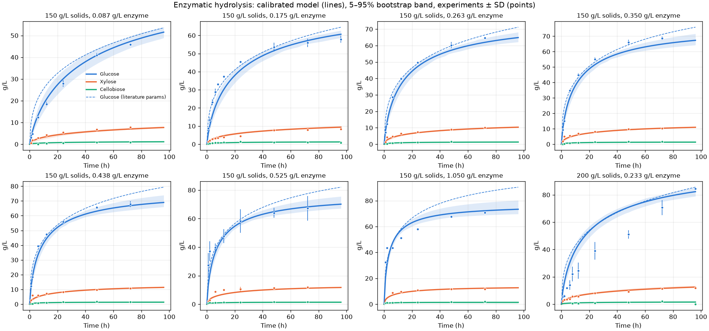

# Calibração da hidrólise enzimática

Gerado por `pipeline/02_calibrate_hydrolysis.py`.

## Escolha da estrutura (validação cruzada deixando uma condição de fora)

RMSE (g/L) ao prever cada ensaio com o modelo calibrado nos outros 7:

| Variante | Adsorção | gamma | Fração reativa | Glicose | Xilose | Celobiose |
|---|---|---|---|---|---|---|
| original | initial | 1 | 1 | 8.50 | 1.30 | 0.41 |
| quasi_steady | quasi_steady | 1 | 1 | 8.59 | 1.30 | 0.42 |
| initial_gamma | initial | ajustado | 1 | 8.47 | 1.33 | 0.42 |
| quasi_steady_gamma | quasi_steady | ajustado | 1 | 8.44 | 1.32 | 0.42 |
| initial_reactive | initial | 1 | ajustada | 7.83 | 1.27 | 0.42 |
| quasi_steady_reactive | quasi_steady | 1 | ajustada | 7.77 | 1.27 | 0.42 |
| quasi_steady_reactive_gamma **(escolhida)** | quasi_steady | ajustado | ajustada | 7.69 | 1.25 | 0.42 |
| quasi_steady_reactive_twopool | quasi_steady | 1 | ajustada | 7.83 | 1.27 | 0.42 |

Referência, parâmetros publicados sem ajuste: original: glucose 8.86, xylose 1.54, cellobiose 0.63; quasi_steady: glucose 8.36, xylose 1.67, cellobiose 0.71

## Ajuste final (todos os 8 ensaios)

RMSE: glucose 7.23 g/L, xylose 1.14 g/L, cellobiose 0.35 g/L

| Ensaio | t (h) | Glicose exp. | Literatura | Calibrado |
|---|---|---|---|---|
| S150_E5FPU | 72 | 45.9 | 49.2 | 47.2 |
| S150_E10FPU | 96 | 57.9 | 64.5 | 60.6 |
| S150_E15FPU | 72 | 64.7 | 66.4 | 61.9 |
| S150_E20FPU | 72 | 68.7 | 71.1 | 64.8 |
| S150_E25FPU | 72 | 67.7 | 74.7 | 66.8 |
| S150_E30FPU | 72 | 67.3 | 77.5 | 68.2 |
| S150_E60FPU | 72 | 70.8 | 86.6 | 72.2 |
| S200_E10FPU | 96 | 84.5 | 85.6 | 82.3 |

## Parâmetros (razão em relação ao valor publicado; faixa 5–95% do bootstrap)

| Parâmetro | Calibrado | Publicado | Razão | Faixa bootstrap |
|---|---|---|---|---|
| k_1r | 0.09923 | 0.177 | 0.56 | 0.02166–0.3181 |
| k_2r | 1.232 | 8.81 | 0.14 | 0.7825–1.836 |
| k_3r | 65.47 | 201 | 0.33 | 55.95–189.4 |
| k_4r | 13.3 | 16.34 | 0.81 | 4.468–20.24 |
| k_11G2 | 0.6263 | 0.402 | 1.56 | 0.6077–2.843 |
| k_11G | 3.257 | 2.71 | 1.20 | 0.6198–62.24 |
| k_11X | 3.07 | 2.15 | 1.43 | 2.244–14.37 |
| k_21G2 | 121.7 | 119.6 | 1.02 | 120.9–125 |
| k_21G | 56.52 | 4.69 | 12.05 | 39.73–83.87 |
| k_21X | 3.397 | 0.095 | 35.76 | 1.858–5.379 |
| k_3M | 81.58 | 26.6 | 3.07 | 28.32–95.51 |
| k_31G | 7.82 | 11.06 | 0.71 | 7.911–34.53 |
| k_31X | 0.4722 | 1.023 | 0.46 | 0.3994–3.002 |
| k_41G2 | 15.58 | 16.25 | 0.96 | 14.4–18.02 |
| k_41G | 3.635 | 4 | 0.91 | 2.208–50.63 |
| k_41X | 151.2 | 154 | 0.98 | 150.5–180.2 |
| k_ad | 30.93 | 7.16 | 4.32 | 14.32–37.54 |
| E_max | 0.04991 | 0.00832 | 6.00 | 0.0256–0.06438 |
| gamma | 0.1675 | 1 | 0.17 | 0.1496–0.2592 |
| f_C | 0.7104 | 1 | 0.71 | 0.6751–0.7864 |
| f_H | 1 | 1 | 1.00 | 0.9472–1 |

Observações:
- celobiose censurada (abaixo da celobiose do extrato enzimático) e réplicas idênticas ficam fora do ajuste;
- todos os ensaios têm a mesma composição de sólido; outras composições dependem da estrutura do modelo.
