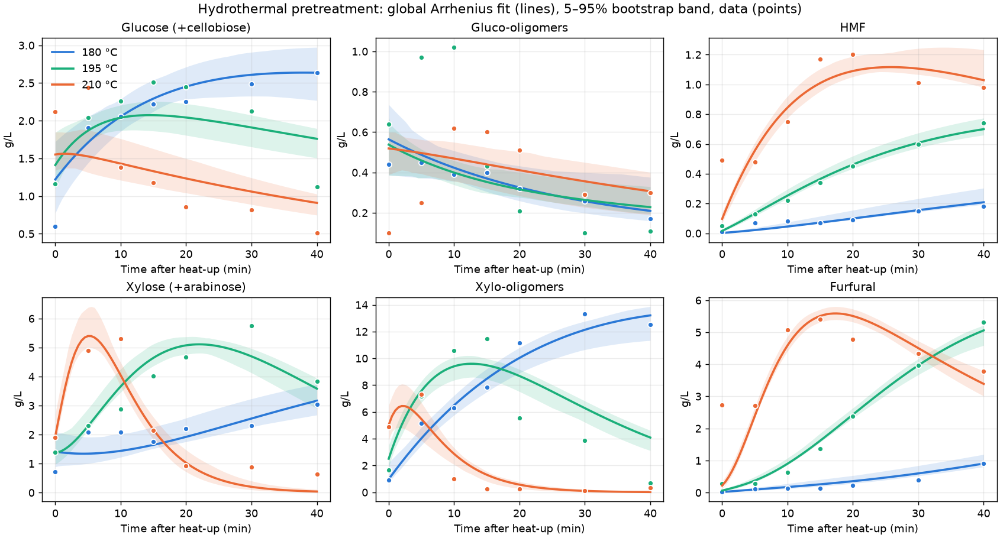

# Calibração do pré-tratamento hidrotérmico

Gerado por `pipeline/01_calibrate_pretreatment.py`.

Ajuste global (Arrhenius + rampa de aquecimento) às 21 amostras de licor de Rocha et al. (2017),
com priori fraca nas energias de ativação (120 ± 50 kJ/mol).

## Qualidade do ajuste

| Espécie | RMSE (g/L), todos os pontos | R², todos | RMSE t > 0 | RMSE t > 0, ajuste original por T |
|---|---|---|---|---|
| glucose | 0.377 | 0.696 | 0.350 | 0.376 |
| glucooligomers | 0.222 | 0.202 | 0.215 | 0.317 |
| hmf | 0.104 | 0.927 | 0.063 | 0.123 |
| xylose | 0.564 | 0.860 | 0.586 | 0.667 |
| xylooligomers | 1.487 | 0.886 | 1.594 | 1.334 |
| furfural | 0.609 | 0.906 | 0.276 | 0.381 |

O ajuste original usa as medidas em t = 0 como condição inicial em cada temperatura; o modelo
global prevê também t = 0 (fim do aquecimento) e é contínuo em temperatura.

Taxa de aquecimento ajustada: 10.28 °C/min (de 100 °C até a temperatura de operação).

## Parâmetros (k a 195 °C, 1/min; Ea, kJ/mol)

| Reação | k_ref hemicelulose | Ea hemicelulose | k_ref celulose | Ea celulose |
|---|---|---|---|---|
| k1 polímero→monômero | 0.0000 (0.0000–0.0099) | 120 | 0.0078 (0.0057–0.0097) | 73 |
| k2 polímero→oligômero | 0.0703 (0.0569–0.0821) | 111 | 0.0004 (0.0002–0.0031) | 141 |
| k3 oligômero→monômero | 0.0708 (0.0607–0.0808) | 205 | 0.0623 (0.0309–0.2959) | 57 |
| k4 monômero→furano | 0.0583 (0.0542–0.0629) | 138 | 0.0215 (0.0194–0.0253) | 203 |
| k5 monômero→degradação | 0.0558 (0.0480–0.0678) | 150 | 0.1164 (0.1040–0.1568) | 97 |
| k6 furano→degradação | 0.0101 (0.0085–0.0145) | 141 | 0.0281 (0.0196–0.0355) | 126 |

Entre parênteses: faixa 5–95% do bootstrap.

## Conferência física (40 min)

| T (°C) | Hemicelulose solubilizada (%) | Perda de celulose (%) |
|---|---|---|
| 180 | 67.7 (58.5–72.8) | 16.6 (14.2–23.5) |
| 195 | 94.6 (90.6–97.0) | 29.3 (28.3–35.3) |
| 210 | 99.9 (99.5–100.0) | 47.6 (46.4–55.7) |

Açúcares livres no licor no início do aquecimento (g por g de sólido, base anidra): glucose 0.0084, glucooligomers 0.0055, xylose 0.0129, xylooligomers 0.0000
