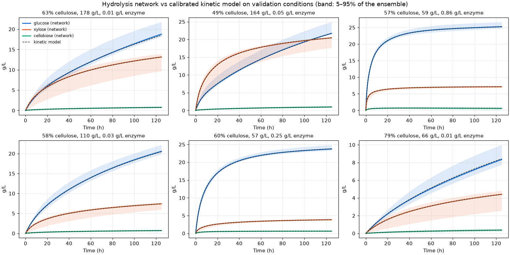

# Avaliação das redes substitutas

Gerado por `pipeline/05_evaluate.py`.

## Pré-tratamento

### Rede × modelo mecanístico (200 condições sorteadas na faixa do app, 0–52 min)

| Saída | RMSE (g/L) | Erro máximo (g/L) |
|---|---|---|
| glucose | 0.0518 | 0.5225 |
| glucooligomers | 0.0313 | 0.2062 |
| hmf | 0.0110 | 0.1286 |
| xylose | 0.0233 | 0.3747 |
| xylooligomers | 0.0300 | 0.5211 |
| furfural | 0.0114 | 0.1826 |
| cellulose | 0.0144 | 0.0718 |
| hemicellulose | 0.0146 | 0.1873 |

Garantias: erro máximo de balanço de massa 3.9e-15 (relativo); condições com valor negativo: 0/200; com polímero aumentando no tempo: 0/200.

### × experimentos (21 amostras de licor; RMSE em g/L)

O ajuste original usa as medidas em t = 0 como condição inicial, então a comparação justa é em t > 0.

| Espécie | Mecanístico, todos os pontos | Mecanístico, t > 0 | Rede, t > 0 | Ajuste original por T, t > 0 |
|---|---|---|---|---|
| glucose | 0.377 | 0.350 | 0.361 | 0.376 |
| glucooligomers | 0.222 | 0.215 | 0.206 | 0.317 |
| hmf | 0.104 | 0.063 | 0.064 | 0.123 |
| xylose | 0.564 | 0.586 | 0.587 | 0.667 |
| xylooligomers | 1.487 | 1.594 | 1.606 | 1.334 |
| furfural | 0.609 | 0.276 | 0.276 | 0.381 |

## Hidrólise enzimática

### Rede × modelo mecanístico (150 condições de validação, 0–125 h a cada 0,5 h)

| Saída | RMSE (g/L) | p95 do erro absoluto (g/L) | Erro máximo (g/L) |
|---|---|---|---|
| glucose | 0.240 | 0.492 | 1.738 |
| xylose | 0.035 | 0.073 | 0.259 |
| cellobiose | 0.007 | 0.011 | 0.094 |

Rendimento de glicose: erro médio absoluto 0.14 p.p., máximo 0.82 p.p.

Garantias (512 condições): t = 0 → glicose 0.0e+00 g/L; xilose decrescente em 0 condições; glicose decrescente (> 0,01 g/L) em 0; rendimento de glicose máximo 0.698 (limite 1).

### × experimentos (8 ensaios)

| Espécie | Literatura (sem ajuste) | Mecanístico calibrado | Validação cruzada (LOCO) | Rede |
|---|---|---|---|---|
| glucose | 8.86 | 7.23 | 7.69 | 7.22 |
| xylose | 1.54 | 1.14 | 1.25 | 1.13 |
| cellobiose | 0.63 | 0.35 | 0.42 | 0.35 |

Pontos de glicose dentro da faixa 5–95% do ensemble (± desvio das réplicas): 47%

| Ensaio | t (h) | Glicose exp. | Mecanístico | Rede |
|---|---|---|---|---|
| S150_E5FPU | 72 | 45.9 | 47.2 | 47.5 |
| S150_E10FPU | 96 | 57.9 | 60.6 | 60.7 |
| S150_E15FPU | 72 | 64.7 | 61.9 | 62.2 |
| S150_E20FPU | 72 | 68.7 | 64.8 | 65.0 |
| S150_E25FPU | 72 | 67.7 | 66.8 | 66.8 |
| S150_E30FPU | 72 | 67.3 | 68.2 | 68.2 |
| S150_E60FPU | 72 | 70.8 | 72.2 | 72.1 |
| S200_E10FPU | 96 | 84.5 | 82.3 | 82.5 |
